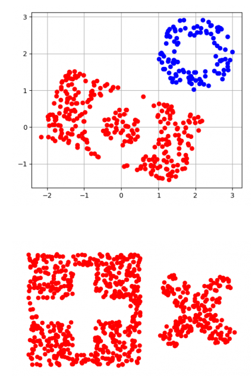
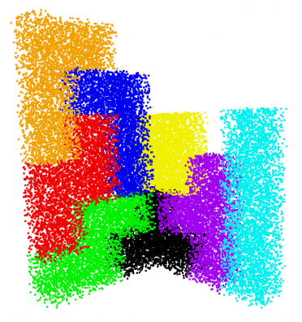

# 3D_Bildverarbeitung
# Punktwolke maskieren

## Punktwolke mit Grenzen erstellen
```
Np.random.uniform(untere_Grenze, obere_Grenze, Anzahl_Punkte)
```
## Ring maskieren
je nachdem was maskiert werden will unterschiedlich
## Translatieren und Rotieren
```
Trafo2d(Translation=(x,y), Rotation=np.deg2rad(Winkel))
```
# Tetris spielen

## Verschiedene Punktwolken in eine 
```
Punktwolke = np.vstack((Punktwolke1, Punktwolke2))
```
